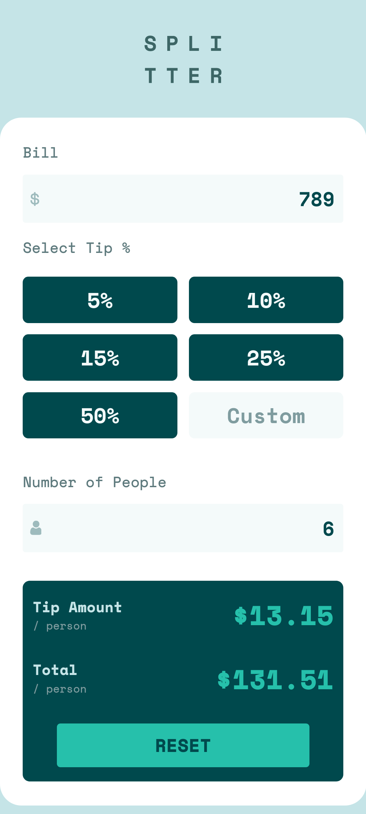
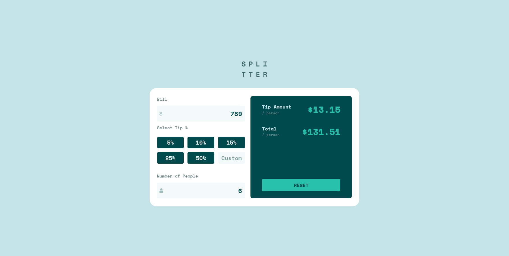

# Frontend Mentor - Tip calculator app solution

This is a solution to the [Tip calculator app challenge on Frontend Mentor](https://www.frontendmentor.io/challenges/tip-calculator-app-ugJNGbJUX). Frontend Mentor challenges help you improve your coding skills by building realistic projects.

## Table of contents

- [Overview](#overview)
  - [The challenge](#the-challenge)
  - [Screenshot](#screenshot)
  - [Links](#links)
  - [Built with](#built-with)
- [Author](#author)

## Overview

### The challenge

Users should be able to:

- View the optimal layout for the app depending on their device's screen size
- See hover states for all interactive elements on the page
- Calculate the correct tip and total cost of the bill per person

### Screenshot

### Links

- Solution URL: [Solution URL](https://github.com/mikeqd/tip-calculator-solution.git)
- Live Site URL: [Live Site URl](https://mikeqd.github.io/tip-calculator-solution/)

## My process

### Built with

- Semantic HTML5 markup
- CSS custom properties
- Flexbox
- CSS Grid
- Mobile-first workflow

**Note: These are just examples. Delete this note and replace the list above with your own choices**

## Author

- Website - [Michael Quam Donkor](https://sveltekit-portfolio-v1.vercel.app/)
- Frontend Mentor - [@mikeqd](https://www.frontendmentor.io/profile/mikeqd)
- Twitter - [@1youngdev](https://www.twitter.com/1youngdev)

**Note: Delete this note and add/remove/edit lines above based on what links you'd like to share.**
